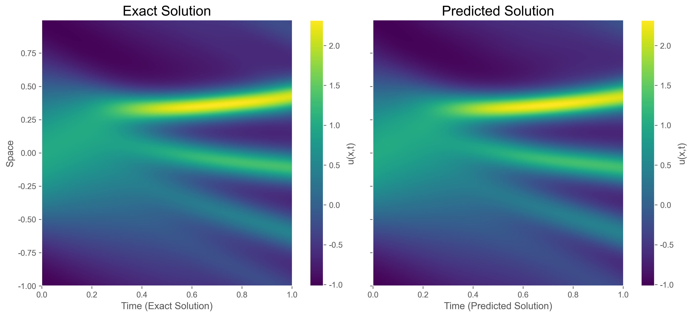
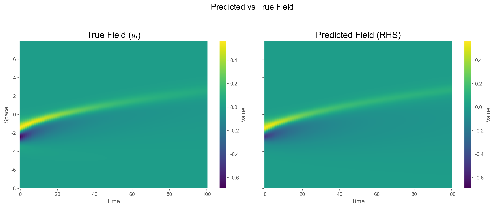
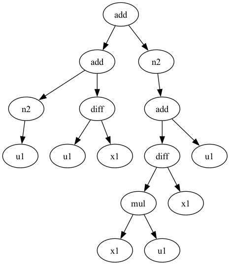

<div align="center">

# KD

**Symbolic PDE Discovery from Data**

Discover the governing partial differential equations hidden in your data — automatically.

</div>

---

KD is a modular toolkit for symbolic equation discovery, with a strong focus on
partial differential equations (PDEs). It ships four complementary discovery
engines, a unified dataset interface, and built-in publication-quality
visualisation.

## Highlights

- **4 discovery methods** covering sparse regression, genetic algorithms, deep
  reinforcement learning, and physics-informed neural networks
- **Unified `PDEDataset`** — load built-in benchmarks in one line or bring your
  own gridded data
- **Built-in visualisation** — discovered equations, field comparisons, residual
  diagnostics, expression trees, and more
- **N-D support** — works with 1-D, 2-D, and 3-D spatial data out of the box

## Quick Start

### Installation

Requires **Python >= 3.9** and PyTorch.

```bash
pip install -e .

# (optional) enable PySR-based symbolic regression
pip install 'kd[pysr]'
```

### Discover a PDE in 3 lines

```python
from kd.dataset import load_pde
from kd.model import KD_SGA

dataset = load_pde("burgers")
model = KD_SGA(sga_run=30, num=20, depth=4, width=5)
model.fit_dataset(dataset)
print(model.equation_latex())  # u_t = -1.00 u u_x + 0.10 u_xx
```

### Visualise results

```python
from kd.viz import configure, render_equation, plot_field_comparison
from pathlib import Path

configure(save_dir=Path("artifacts/my_run"))
render_equation(model)               # equation as LaTeX-rendered PNG
plot_field_comparison(model, ...)     # predicted vs true field heatmap
```

<div align="center">

<p><em>Exact vs predicted solution — KdV equation via KD_DLGA.</em></p>
</div>

## Models at a Glance

| Model | Method | Strengths | Sparse&nbsp;Data | N-D |
|-------|--------|-----------|:-:|:-:|
| **KD_SGA** | Sparse genetic algorithm | Fast, interpretable, built-in LaTeX output | &check; | &check; |
| **KD_DLGA** | Deep-learning genetic algorithm | Rich optimisation diagnostics, neural surrogate | &check; | &check; |
| **KD_DSCV** | DISCOVER (RL + STRidge) | Flexible operator search, expression trees | &check; | &check; |
| **KD_DSCV_SPR** | DISCOVER + PINN | Handles very sparse / noisy observations | &check;&check; | &check; |
| **KD_PySR** | PySR wrapper (optional) | General symbolic regression `fit(X, y)` | &check; | &mdash; |

## Example Gallery

<table>
<tr>
<td align="center" colspan="2"><br><em>KdV equation discovered by KD_DLGA</em></td>
</tr>
<tr>
<td align="center"><br><em>Burgers — DSCV field comparison</em></td>
<td align="center"><br><em>Discovered expression tree</em></td>
</tr>
</table>

See [`examples/`](examples/) for 14+ runnable scripts covering every model and
visualisation mode.

## Built-in Datasets

```python
from kd.dataset import load_pde, list_available_datasets

print(list_available_datasets())
# ['chafee-infante', 'burgers', 'kdv', 'fisher', ...]

dataset = load_pde("burgers")   # returns a PDEDataset
```

You can also construct a `PDEDataset` from your own NumPy arrays:

```python
from kd.dataset import PDEDataset

dataset = PDEDataset(
    equation_name="my_pde",
    fields_data={"u": u_array},
    coords_1d={"x": x, "t": t},
    axis_order=["x", "t"],
    target_field="u",
    lhs_axis="t",
)
```

## Package Layout

```
kd/
├── base.py        # Shared estimator base class
├── dataset/       # PDEDataset, registry, loaders
├── model/         # KD_SGA, KD_DLGA, KD_DSCV, KD_PySR
├── viz/           # Unified visualisation facade
└── utils/         # Logging, FD helpers, solver utilities
```

## Acknowledgements

KD draws on ideas and code from several open-source projects:

- [DISCOVER](https://github.com/menggedu/DISCOVER)
- [Deep Symbolic Optimization](https://github.com/dso-org/deep-symbolic-optimization)
- [SymPy](https://github.com/sympy/sympy)
- [DeepXDE](https://github.com/lululxvi/deepxde)
- [PySR](https://github.com/MilesCranmer/PySR)
