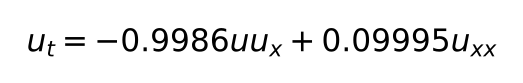
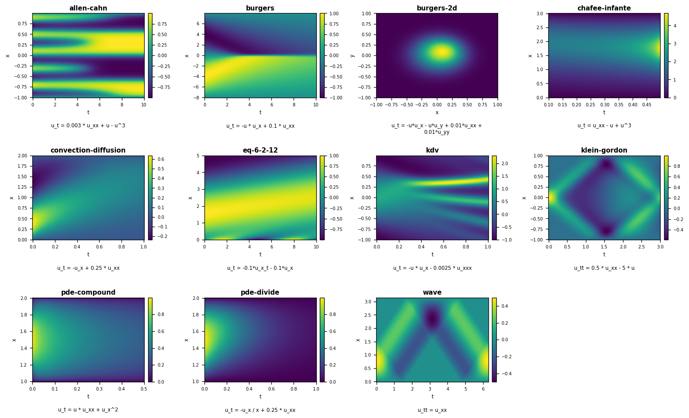
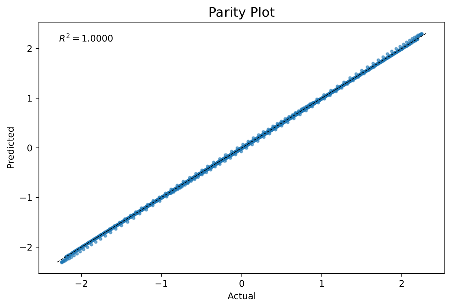
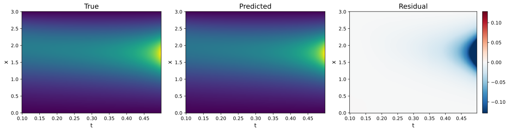

<div align="center">

# Knowledge Discovery (KD)

**Symbolic PDE discovery from data**

</div>

---

KD discovers the governing partial differential equation from data: give it a
field sampled on a spatiotemporal grid, get back a symbolic PDE. Five
in-house discovery engines (**SGA**, **DLGA**, **DISCOVER**, **EqGPT**,
**LLM4ED**) run behind one `kd.Model` API, sharing a single dataset
interface, term evaluator, and HTML-report visualization.

<div align="center">
<br>
<em>2D Burgers (<code>u_t = -u·u_x - u·u_y + 0.01·∇²u</code>): the field's true evolution beside the PDE integrated forward through the platform. Regenerate with <code>examples/14_field_animation_2d.py</code>.</em>
</div>

## Install

Requires **Python >= 3.11** and **PyTorch >= 2.0**.

```bash
git clone -b trunk https://github.com/Scientific-Artificial-Intelligence-Lab/kd.git
cd kd
uv sync
```

## Quick start

```python
import kd

# Generate a synthetic Burgers dataset.
dataset = kd.generate_burgers_data(nx=64, nt=32, nu=0.1, seed=0)

model = kd.Model(algorithm="sga", generations=30, population=15, seed=0)
model.fit(dataset)

print(model.best_expr_)    # u_t = -0.9863*mul(u_x, u) + 0.09955*diff_x(u_x)
print(model.best_score_)   # -11.38 (AIC, lower is better)
```

The printed expression is KD's canonical function-call notation (funcall IR): `mul(u_x, u)` is
`u*u_x` and `diff_x(u_x)` is `u_xx`, so the discovered equation reads
`u_t = -0.99*u*u_x + 0.0996*u_xx` — the Burgers equation recovered from data
with fitted coefficients (ground truth: `u_t = -1*u*u_x + 0.1*u_xx`).
The HTML report renders it in standard notation:

<div align="center">
<br>
<em>The discovered equation as rendered in the report (longer run on the
bundled 256×201 Burgers benchmark).</em>
</div>

<div align="center">
<br>
<em>True vs predicted solution (Burgers equation).</em>
</div>

See [`examples/`](examples/) for runnable scripts covering every engine,
including [`09_compare_algorithms.py`](examples/09_compare_algorithms.py),
which runs the engines on the same dataset and ranks the discovered
equations on one unified NMSE ruler.

## Engines

All five engines are re-implementations of algorithms developed in this
lab, refactored onto KD's shared platform. Swap the `algorithm=` string to
switch:

| Algorithm | `algorithm=` | Origin | Approach |
|-----------|--------------|--------|----------|
| **SGA** | `"sga"` | Chen et al. 2022 (SGA-PDE) | Genetic algorithm over symbolic expression trees |
| **DLGA** | `"dlga"` | Xu et al. 2020 | Neural-network surrogate + genetic algorithm |
| **DISCOVER** | `"discover"` | Du et al. 2024 | LSTM controller + policy gradient |
| **EqGPT** | `"eqgpt"` | Xu et al. 2025 (EqGPT) | Pretrained generative GPT proposes candidate PDEs, then reward-guided fine-tuning |
| **LLM4ED** | `"llm4ed"` | Du et al. 2024 (LLM4ED) | An LLM proposes candidate equations as text, scored by a sparse-regression reward |

EqGPT needs its pretrained GPT weights, which are not vendored; see
[`examples/16_eqgpt.py`](examples/16_eqgpt.py) for where to place them.
LLM4ED runs fully offline with an injected provider, or against any
OpenAI-compatible API (see [`examples/17_llm4ed.py`](examples/17_llm4ed.py)).

Two external baselines can also be driven through the same facade for
cross-checking: the PySR symbolic regressor (`algorithm="pysr"`, needs
`uv sync --extra pysr`) and PySINDy's native STLSQ sparse-regression optimizer
over the KD term library (`algorithm="pysindy"`, needs
`uv sync --extra pysindy`).

## Datasets

### Simulated PDE datasets

The simulated datasets come from this lab's PDE-discovery papers —
**SGA-PDE** (Chen et al., *Phys. Rev. Research* **4**, 023174, 2022),
**EqGPT** (Xu et al., *Nat Commun* **16**, 10255, 2025) and **LLM4ED**
(Du et al., *Phys. Fluids* **36**, 097121, 2024):

<div align="center">

</div>

| Dataset | Governing PDE | Grid | What it models |
|---------|---------------|------|----------------|
| `allen-cahn` | `u_t = 0.003·u_xx + u - u³` | `(256, 201)` | phase separation (reaction–diffusion) |
| `burgers` | `u_t = -u·u_x + 0.1·u_xx` | `(256, 201)` | shock waves in fluids |
| `burgers-2d` | `u_t = -u·u_x - u·u_y + 0.01·∇²u` | `(101, 51, 100)` | 2D Burgers flow |
| `chafee-infante` | `u_t = u_xx - u + u³` | `(301, 200)` | reaction–diffusion |
| `convection-diffusion` | `u_t = -u_x + 0.25·u_xx` | `(256, 100)` | advection plus diffusion |
| `eq-6-2-12` | `u_t = -0.1·u_x_t - 0.1·u_x` | `(501, 501)` | handbook equation with a mixed space–time derivative |
| `kdv` | `u_t = -u·u_x - 0.0025·u_xxx` | `(256, 201)` | shallow-water solitons |
| `klein-gordon` | `u_tt = 0.5·u_xx - 5·u` | `(201, 201)` | relativistic wave equation |
| `llm4ed-fisher` | `u_t = 0.02·u_xx + 10·u·(1-u)` | `(x, t)` | population growth with spatial spread |
| `llm4ed-fisher-nonlinear` | `u_t = 0.02·(u·u_xx + u_x²) + 10·u·(1-u)` | `(x, t)` | Fisher growth with nonlinear diffusion |
| `llm4ed-heat` | `u_t = 0.05·u_xx` | `(x, t)` | heat conduction |
| `pde-compound` | `u_t = u·u_xx + u_x²` | `(100, 251)` | constructed compound-structure case |
| `pde-divide` | `u_t = -u_x/x + 0.25·u_xx` | `(100, 251)` | constructed case with a division term |
| `wave` | `u_tt = u_xx` | `(161, 321)` | vibrating string |

Load any bundled dataset with `kd.load_burgers()`, or browse the catalog
programmatically with `kd.list_datasets()` / `kd.get_dataset(id)`; each entry
carries its `.source` and `.license` (see [`NOTICE`](NOTICE)).
`kd.generate_burgers_data()`, `kd.generate_diffusion_data()`, … build
synthetic datasets on demand. Remote (HF) entries
are fetched with `kd.load_from_hub(id)` after installing the hub extra
(`uv sync --extra hub`) and are cached locally, checksum-verified, and
revision-pinned; browse them with `kd.list_remote_datasets()`.

### Real-world experimental data

KD also bundles **real-world experimental data** — measured, not simulated:

| Dataset | Type | Measured quantity | Size | Reference |
|---------|------|-------------------|------|-----------|
| `wave-breaking` | wave-tank experiment (Imperial College London) | surface elevation `η(t, x)` of wave groups approaching breaking | 314,478 points (one of the paper's 12 experiments) | Xu et al., *Nat Commun* **16**, 10255 (2025) |
| `tlc-cc` | automated chromatography experiment | column retention volumes `V_S`, `V_E` vs `(R_F, r)` | 2 tables × 74 conditions | Xu et al., *Nat Commun* **16**, 832 (2025) |

**Wave breaking** — surface elevation of focused wave groups approaching
breaking, reconstructed frame by frame from camera images in the wave-tank
experiments of the EqGPT paper. KD bundles one of the paper's 12 experiments
(case `N_G2Tp12A100_broad`) as scattered `(t, x, η)` points — a table rather
than a gridded `PDEDataset`.

**TLC-CC** — column-chromatography retention volumes measured on an
automated platform (192 compounds, 4 g silica columns), aggregated to mean
start/end retention volumes over 74 `(R_F, r)` conditions — ready for KD's
scalar symbolic-regression entries
([`examples/12`](examples/12_symbolic_regression.py),
[`examples/13`](examples/13_sindy_basis_sr.py)).

```python
wb = kd.load_wave_breaking()          # η(t, x): scattered wave-tank points
cc = kd.load_tlc_cc(target="start")   # X = (R_F, r), y = V_S
```

Experimental background, protocols, and references for both datasets are in
the papers and their Supplementary Information
([wave breaking](https://doi.org/10.1038/s41467-025-65114-2),
[TLC-CC](https://doi.org/10.1038/s41467-025-56136-x)).

## Bring Your Own Data

Wrap your own arrays (any field on a regular grid) into a `PDEDataset`:

```python
import torch

import kd

x = torch.linspace(0.0, 1.0, 64)   # spatial grid
t = torch.linspace(0.0, 1.0, 32)   # time grid
u = torch.rand(64, 32)             # your measured field on the (x, t) grid

dataset = kd.PDEDataset.from_arrays(
    coords={"x": x, "t": t},        # one 1D array per axis; insertion order sets the axis order
    fields={"u": u},                # field shaped (len(x), len(t))
    lhs="u_t",                      # left-hand side of the equation to discover
    periodic={"x"},                 # optional: periodic axes improve fits
    name="my_pde",
    ground_truth="u_t = 0.1 * u_xx",
)
```

The same call handles 2D spatial fields: add a `y` axis and pass an nD field,
e.g. `coords={"x": x, "y": y, "t": t}` with `u` shaped `(len(x), len(y),
len(t))`.

## Score Your Own Candidate Terms

You don't have to run a search to use KD's evaluator. `evaluate_terms` fits
a candidate term set directly; `validate_terms` classifies terms without
fitting. Both fail loud with a complete per-term rejection report (reason +
hint), so a caller (human or LLM agent) can repair and resubmit:

```python
import kd

result = kd.evaluate_terms(dataset, ["diff2_x(u)", "mul(u, diff_x(u))"])
print(result.coefficients, result.nmse)

report = kd.validate_terms(dataset, ["u_xx", "u + u_x"])  # no fit performed
for v in report.rejected:
    print(v.term, "->", v.reason)    # "u + u_x" is not canonical funcall IR
```

## Long Runs: Checkpoint & Resume

```python
model = kd.Model(algorithm="discover", generations=500, checkpoint_dir="ckpts")
model.fit(dataset)                   # writes ckpts/checkpoint_*.pt as it goes

# Later (or after a crash), continue from the saved search state:
model = kd.Model(algorithm="discover", generations=200)
model.fit(dataset, resume_from="ckpts/checkpoint_final.pt")
```

The checkpoint restores search state (population / controller weights /
best); generations and other settings come from the new `Model`.

The checkpoint directory also carries a `manifest.json` ledger: one entry per
checkpoint recording filename, iteration, best score and expression, algorithm,
seed, config hash and write time. Read it instead of globbing filenames:

```python
for entry in kd.load_checkpoint_manifest("ckpts"):
    print(entry.filename, entry.iteration, entry.best_score)
```

The reader is read-only and fail-loud, and verifies the whole directory
contract. Call it on a directory whose run has terminated: during a live run a
checkpoint file can briefly exist before its ledger entry is appended.

## Batch Experiments

`kd.harness` runs a declarative experiment matrix and stores sealed evidence:

```python
from pathlib import Path

from kd.harness import ExperimentPlan, PlanEntry, run_plan

plan = ExperimentPlan(
    name="burgers-sweep",
    entries=tuple(
        PlanEntry(
            instrument=engine,
            dataset_ref="burgers",
            seed=seed,
            model_kwargs={"generations": 50},
        )
        for engine in ("sga", "dlga")
        for seed in (0, 1, 2)
    ),
)
result = run_plan(
    plan, datasets={"burgers": dataset}, store_root=Path("evidence")
)
```

Entry order is part of the plan's identity, so a plan hash pins the exact
execution matrix. Each run's evidence is stored with an environment
fingerprint; `build_consensus` aggregates a sealed store across runs, and both
dispatch and consensus results render to markdown or to versioned JSON
artifacts. Execution is serial: the package composes the existing `Model`
surface and adds no routing or budget logic.

The full chain (plan, run, re-open the sealed store, consensus, Markdown +
JSON) runs in about five seconds in
[`examples/19_batch_harness.py`](examples/19_batch_harness.py).

## Visualization

After a fit, render a full HTML report (universal figures plus the fitted
engine's own search diagnostics):

```python
import kd

viz = kd.VizEngine(output_dir="out/my_run")
report = viz.render_all(model.result_, algorithm=model.algorithm_, dataset=dataset)
print(report.report)         # path to report.html
print(len(report.figures))   # number of figure files
```

The report bundles universal figures — the discovered equation rendered in
LaTeX, search convergence, a parity plot, residual maps, True/Predicted field
comparisons — plus the fitted engine's own diagnostics:

<div align="center">
<br>
<em>Parity plot from the report: predicted vs actual <code>u_t</code> for the
discovered Burgers equation (R² = 1.0000).</em>
</div>

<div align="center">
<br>
<em>True / Predicted / Residual panels from a Chafee-Infante fit
(<code>u_t = u_xx - u + u^3</code> recovered by SGA).</em>
</div>

The report also renders the discovered equation as a structure-only **expression
tree**, and (for the SGA engine) the raw **genome tree** of the best evolved
individual, so you can see what the search actually produced versus the sparse
equation it was distilled into:

<div align="center">
<br>
<em>Example: SGA on the built-in Chafee-Infante dataset (recovers
<code>u_t = u_xx - u + u^3</code>). Left: the raw GP genome of the best
individual, still carrying evolved bloat (redundant / zeroed terms). Right: the
discovered equation after sparse selection, operators and derivatives only,
coefficients dropped (they stay in the LaTeX equation figure).</em>
</div>

Every result also carries a `manifest` (dataset fingerprint, seed, KD
version) so a run can be identified and reproduced later.

## Package Layout

```
src/kd/
├── api.py        # Model facade: one-line fit() for every engine
├── evaluate.py   # evaluate_terms / validate_terms: score terms directly
├── data/         # PDEDataset, synthetic generators, dataset loaders
├── search/       # sga / dlga / discover / eqgpt / llm4ed / pysr / pysindy
├── harness/      # batch experiment plans, evidence store, consensus reports
├── viz/          # VizEngine: HTML reports & figures
└── inspect.py    # preview() dataset sanity checks
```

## Origins & Acknowledgements

The SGA, DLGA, DISCOVER, EqGPT, and LLM4ED engines are refactored
re-implementations of algorithms developed in this lab; credit for the
methods belongs to the original works:

- **SGA-PDE**: Chen et al., [SGA-PDE](https://github.com/YuntianChen/SGA-PDE);
  also the source of several bundled datasets (see [`NOTICE`](NOTICE))
- **DLGA**: Xu et al. 2020
- **DISCOVER**: Du et al., [DISCOVER](https://github.com/menggedu/DISCOVER)
- **EqGPT**: Xu et al., [EqGPT](https://github.com/woshixuhao/EqGPT),
  *Nat Commun* **16**, 10255 (2025); also the source of several bundled
  datasets, including the wave-breaking experiments (see [`NOTICE`](NOTICE))
- **LLM4ED**: Du et al., [LLM4ED](https://github.com/menggedu/EDL),
  *Phys. Fluids* **36**, 097121 (2024)

KD also builds on [PySR](https://github.com/MilesCranmer/PySR) and
[PySINDy](https://github.com/dynamicslab/pysindy) (optional external
baselines), [SymPy](https://github.com/sympy/sympy), and
[PyTorch](https://github.com/pytorch/pytorch).

## License

[Apache-2.0](LICENSE). Copyright 2026 Mao, Hao and the Scientific Artificial
Intelligence Lab.
