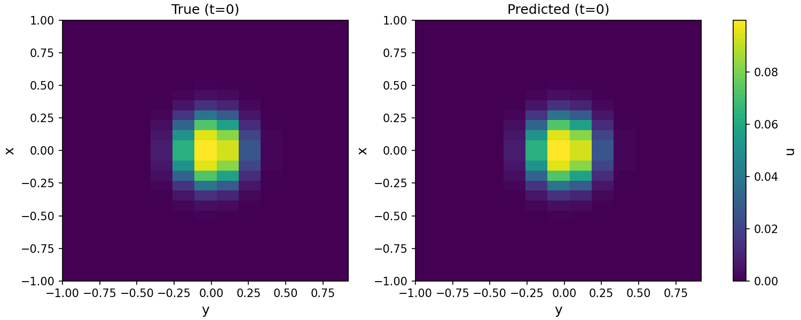
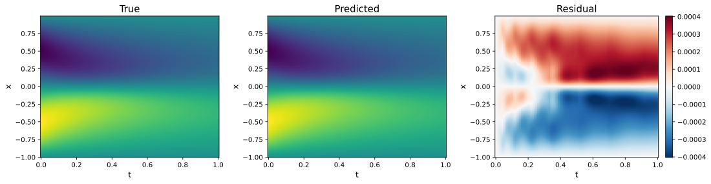
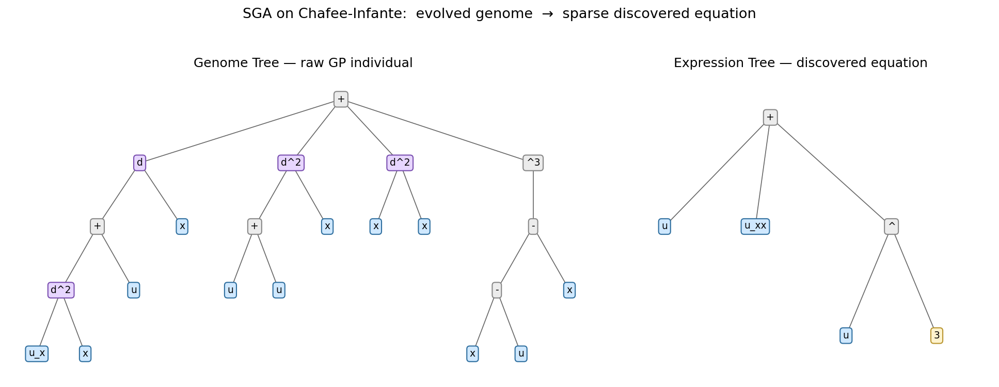

<div align="center">

# Knowledge Discovery (KD)

**Symbolic PDE discovery from data**

</div>

---

KD discovers the governing partial differential equation from data: give it a
field sampled on a spatiotemporal grid, get back a symbolic PDE. Several
discovery engines (**SGA**, **DLGA**, **DISCOVER**, and the external **PySR**)
run behind one `kd.Model` API, sharing a single dataset interface, term
evaluator, and HTML-report visualization. More engines are on the roadmap.

<div align="center">
<br>
<em>2D Burgers (<code>u_t = -u·u_x - u·u_y + 0.01·∇²u</code>): the field's true evolution beside the PDE integrated forward through the platform. Regenerate with <code>examples/14_field_animation_2d.py</code>.</em>
</div>

## Install

Requires **Python >= 3.11** and **PyTorch >= 2.0**.

```bash
git clone -b trunk https://github.com/Scientific-Artificial-Intelligence-Lab/kd.git
cd kd
uv sync                      # add --extra pysr for the PySR engine (Julia)
```

## Quick start

```python
import kd

# Synthetic Burgers data with a known ground truth.
dataset = kd.generate_burgers_data(nx=64, nt=32, nu=0.1, seed=0)

model = kd.Model(algorithm="sga", generations=30, population=15, seed=0)
model.fit(dataset)

print(model.best_expr_)    # u_t = -1.00 u u_x + 0.10 u_xx
print(model.best_score_)   # best AIC
```

<div align="center">
<br>
<em>True vs predicted solution from the fit above (Burgers equation, residual ~1e-4).</em>
</div>

See [`examples/`](examples/) for runnable scripts covering every engine,
including [`09_compare_algorithms.py`](examples/09_compare_algorithms.py),
which runs all four engines on the same dataset and ranks the discovered
equations on one unified NMSE ruler (it needs the `pysr` extra).

## Engines

Swap the `algorithm=` string to switch engines:

| Algorithm | `algorithm=` | Origin | Approach |
|-----------|--------------|--------|----------|
| **SGA** | `"sga"` | Chen et al. 2022 (SGA-PDE) | Genetic algorithm over symbolic expression trees |
| **DLGA** | `"dlga"` | Xu et al. 2020 | Neural-network surrogate + genetic algorithm |
| **DISCOVER** | `"discover"` | Du et al. 2024 | LSTM controller + policy gradient |
| **PySR** | `"pysr"` | Cranmer 2023 | External symbolic-regression engine (Julia) |

SGA, DLGA, and DISCOVER are re-implementations of the original algorithms,
refactored onto KD's shared platform; PySR is an external tool integrated
as-is (requires the `pysr` extra). More engines are planned.

## Datasets

KD bundles a set of classic PDE datasets from the **SGA-PDE** and **EqGPT**
benchmarks, so you can try any engine on a known equation before touching your
own data:

| Dataset | Governing PDE |
|---------|---------------|
| Burgers | `u_t = -u·u_x + 0.1·u_xx` |
| KdV | `u_t = -u·u_x - 0.0025·u_xxx` |
| Chafee-Infante | `u_t = u_xx - u + u³` |
| Allen-Cahn | `u_t = 0.003·u_xx + u - u³` |
| Convection-diffusion | `u_t = -u_x + 0.25·u_xx` |
| PDE-divide | `u_t = -u_x/x + 0.25·u_xx` |
| PDE-compound | `u_t = u·u_xx + u_x²` |
| Eq 6.2.12 | `u_t = -0.1·u_x_t - 0.1·u_x` *(mixed derivative)* |
| 2D Burgers | `u_t = -u·u_x - u·u_y + 0.01·∇²u` |

Load any with `kd.load_burgers()`, or browse the catalog programmatically with
`kd.list_datasets()` / `kd.get_dataset(id)`; each entry carries its `.source`
and `.license` (see [`NOTICE`](NOTICE)). Prefer synthetic data with a known
ground truth? `kd.generate_burgers_data()`, `kd.generate_diffusion_data()`, …
build PDEs on demand.

Beyond the bundled datasets, KD can fetch additional datasets on demand from
HuggingFace with `kd.load_from_hub(id)` after installing the hub extra
(`uv sync --extra hub`). Browse them with `kd.list_remote_datasets()`; remote
files are cached locally, checksum-verified, and revision-pinned.

## Bring Your Own Data

Wrap your own arrays (any field on a regular grid) into a `PDEDataset`:

```python
import torch

import kd

x = torch.linspace(0.0, 1.0, 64)   # spatial grid
t = torch.linspace(0.0, 1.0, 32)   # time grid
u = torch.rand(64, 32)             # your measured field on the (x, t) grid

dataset = kd.PDEDataset.from_arrays(
    coords={"x": x, "t": t},        # one 1D array per axis; insertion order sets the axis order
    fields={"u": u},                # field shaped (len(x), len(t))
    lhs="u_t",                      # left-hand side of the equation to discover
    periodic={"x"},                 # optional: periodic axes improve fits
    name="my_pde",
    ground_truth="u_t = 0.1 * u_xx",
)
```

The same call handles 2D spatial fields: add a `y` axis and pass an nD field,
e.g. `coords={"x": x, "y": y, "t": t}` with `u` shaped `(len(x), len(y),
len(t))`.

## Score Your Own Candidate Terms

You don't have to run a search to use KD's evaluator. `evaluate_terms` fits
a candidate term set directly; `validate_terms` classifies terms without
fitting. Both fail loud with a complete per-term rejection report (reason +
hint), so a caller (human or LLM agent) can repair and resubmit:

```python
import kd

result = kd.evaluate_terms(dataset, ["diff2_x(u)", "mul(u, diff_x(u))"])
print(result.coefficients, result.nmse)

report = kd.validate_terms(dataset, ["u_xx", "u + u_x"])  # no fit performed
for v in report.rejected:
    print(v.term, "->", v.reason)    # "u + u_x" is not canonical funcall IR
```

## Long Runs: Checkpoint & Resume

```python
model = kd.Model(algorithm="discover", generations=500, checkpoint_dir="ckpts")
model.fit(dataset)                   # writes ckpts/checkpoint_*.pt as it goes

# Later (or after a crash), continue from the saved search state:
model = kd.Model(algorithm="discover", generations=200)
model.fit(dataset, resume_from="ckpts/checkpoint_final.pt")
```

The checkpoint restores search state (population / controller weights /
best); generations and other settings come from the new `Model`.

## Visualization

After a fit, render a full HTML report (universal figures plus the fitted
engine's own search diagnostics):

```python
import kd

viz = kd.VizEngine(output_dir="out/my_run")
report = viz.render_all(model.result_, algorithm=model.algorithm_, dataset=dataset)
print(report.report)         # path to report.html
print(len(report.figures))   # number of figure files
```

The report renders the discovered equation as a structure-only **expression
tree**, and (for the SGA engine) the raw **genome tree** of the best evolved
individual, so you can see what the search actually produced versus the sparse
equation it was distilled into:

<div align="center">
<br>
<em>Example: SGA on the built-in Chafee-Infante benchmark (recovers the ground truth
<code>u_t = u_xx - u + u^3</code>). Left: the raw GP genome of the best
individual, still carrying evolved bloat (redundant / zeroed terms). Right: the
discovered equation after sparse selection, operators and derivatives only,
coefficients dropped (they stay in the LaTeX equation figure).</em>
</div>

Every result also carries a `manifest` (dataset fingerprint, seed, KD
version) so a run can be identified and reproduced later.

## Package Layout

```
src/kd/
├── api.py        # Model facade: one-line fit() for every engine
├── evaluate.py   # evaluate_terms / validate_terms: score terms directly
├── data/         # PDEDataset, synthetic generators, benchmark loaders
├── search/       # sga / dlga / discover / pysr engines + their configs
├── viz/          # VizEngine: HTML reports & figures
└── inspect.py    # preview() dataset sanity checks
```

## Origins & Acknowledgements

The SGA, DLGA, and DISCOVER engines are refactored re-implementations of
algorithms developed in this lab; credit for the methods belongs to the
original works:

- **SGA-PDE**: Chen et al., [SGA-PDE](https://github.com/YuntianChen/SGA-PDE);
  also the source of the bundled benchmark datasets (see [`NOTICE`](NOTICE))
- **DLGA**: Xu et al. 2020
- **DISCOVER**: Du et al., [DISCOVER](https://github.com/menggedu/DISCOVER)

KD also builds on [PySR](https://github.com/MilesCranmer/PySR) (integrated
as an optional engine), [SymPy](https://github.com/sympy/sympy), and
[PyTorch](https://github.com/pytorch/pytorch).

## License

[Apache-2.0](LICENSE). Copyright 2026 Mao, Hao and the Scientific Artificial
Intelligence Lab.
